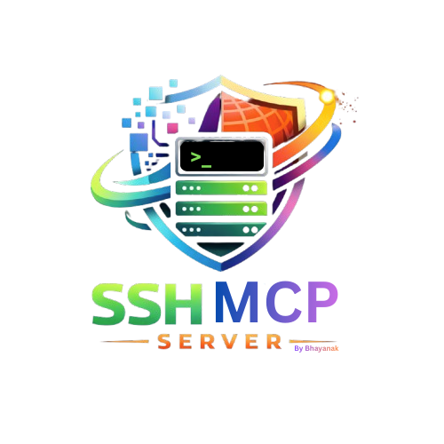

<p align="center">
  
</p>


<p align="center">
  <a href="https://www.python.org/downloads/">
    
  </a>
  <a href="https://opensource.org/licenses/MIT">
    
  </a>
</p>

<h1 align="center">SSH MCP Server</h1>

<p align="center">
  <strong>Hardened SSH operations for VS Code Copilot Chat via the Model Context Protocol</strong>
</p>

<p align="center">
  <a href="#features">Features</a> &bull;
  <a href="#quick-start">Quick Start</a> &bull;
  <a href="#tools">Tools</a> &bull;
  <a href="#configuration">Configuration</a> &bull;
  <a href="#security">Security</a> &bull;
  <a href="#testing">Testing</a> &bull;
  <a href="#contributing">Contributing</a>
</p>

---

## What Is This?

SSH MCP Server lets you manage remote Linux servers through **natural language** in VS Code Copilot Chat. Instead of switching to a terminal and remembering SSH commands, you just ask:

> "Check disk usage on production-web"

> "Show me the last 200 lines of /var/log/nginx/error.log on staging"

> "Download /var/log/syslog from web-server-01 for incident INC-2026-0309"

The server enforces **strict security policies** — no raw shell access, all commands go through pre-approved templates, parameters are regex-validated, secrets in output are auto-redacted, and privileged operations require an approval workflow.

## Features

- **13 MCP tools** — host discovery, command execution, file transfer, SSH key management, certificate lifecycle, approval workflows
- **Template-only execution** — no raw shell; every command matches a registered template with regex-validated parameters
- **3-tier security model** — read-only (Tier 0), controlled mutation with confirmation (Tier 1), privileged with approval workflow (Tier 2)
- **Automatic secret redaction** — AWS keys, bearer tokens, passwords, private keys are scrubbed from output
- **Tamper-evident audit log** — every operation is logged with hash-chain integrity verification
- **Short-lived SSH certificates** — issue and revoke certificates with TTL enforcement via a local CA
- **Path traversal protection** — `..` sequences blocked in all path parameters and file transfers
- **Transfer policy** — allowed paths, blocked extensions, size limits, mandatory justification for downloads

## Quick Start

### Prerequisites

- **Python 3.11+**
- **VS Code** with **GitHub Copilot** extension
- SSH access to at least one remote Linux host

---

### Install from PyPI (Recommended — use with any project)

```bash
# Install globally (or use pipx for isolation)
pip install ssh-mcp-server-copilot

# Initialize config directory (~/.ssh-mcp)
ssh-mcp-server-copilot init
```

This creates `~/.ssh-mcp/` with:
- `hosts.json` — edit with your real servers
- `templates.json` — pre-configured command templates
- `audit_logs/`, `cert_data/`, `approval_data/` — runtime directories

**Add to any VS Code project** — create `.vscode/mcp.json`:
```json
{
  "servers": {
    "ssh-mcp": {
      "type": "stdio",
      "command": "ssh-mcp-server-copilot"
    }
  }
}
```

**Or enable globally** — add to VS Code **User Settings (JSON)** (`Cmd+Shift+P` → "Preferences: Open User Settings (JSON)"):
```json
{
  "mcp": {
    "servers": {
      "ssh-mcp": {
        "type": "stdio",
        "command": "ssh-mcp-server-copilot"
      }
    }
  }
}
```

That's it — the server is now available in every VS Code window.

---

### Install from Source (for development / contributing)

```bash
git clone https://github.com/bhayanak/ssh-mcp-server.git
cd ssh-mcp-server

python -m venv .venv
source .venv/bin/activate   # macOS/Linux
# .venv\Scripts\activate    # Windows

pip install -e ".[dev]"
```

For local development, create `.vscode/mcp.json` pointing to the local source:
```json
{
  "servers": {
    "ssh-mcp": {
      "type": "stdio",
      "command": "${workspaceFolder}/.venv/bin/python",
      "args": ["-m", "ssh_mcp.server"],
      "env": {
        "SSH_MCP_CONFIG_DIR": "${workspaceFolder}/config",
        "SSH_MCP_HOSTS_FILE": "${workspaceFolder}/config/hosts.json",
        "SSH_MCP_TEMPLATES_FILE": "${workspaceFolder}/config/templates.json",
        "SSH_MCP_AUDIT_LOG_DIR": "${workspaceFolder}/audit_logs",
        "SSH_MCP_CERT_DATA_DIR": "${workspaceFolder}/cert_data",
        "SSH_MCP_APPROVAL_DATA_DIR": "${workspaceFolder}/approval_data",
        "SSH_MCP_SSH_KNOWN_HOSTS_FILE": "~/.ssh/known_hosts"
      }
    }
  }
}
```

---

### Configure Your Hosts

Edit the hosts file with your actual servers. If you used `ssh-mcp-server-copilot init`, edit `~/.ssh-mcp/hosts.json`. If developing from source, edit `config/hosts.json`.

```json
[
  {
    "host_id": "my-server",
    "hostname": "192.168.1.10",
    "port": 22,
    "ssh_user": "deploy",
    "labels": {"env": "production", "role": "web"},
    "description": "Production web server",
    "allowed_roles": ["operator", "admin"]
  }
]
```

| Field | Required | Description |
|-------|----------|-------------|
| `host_id` | Yes | Unique identifier (alphanumeric, dots, dashes) |
| `hostname` | Yes | IP address or FQDN |
| `port` | No | SSH port (default: 22) |
| `ssh_user` | Yes* | Remote SSH username. If empty, uses your OS username |
| `labels` | No | Key-value tags for organization |
| `description` | No | Human-readable description |
| `allowed_roles` | No | Which roles can access this host (default: operator, admin) |

### Set Up SSH Access

Your SSH key must be authorized on each host:

```bash
# Generate a key if you don't have one
ssh-keygen -t ed25519 -C "your-email@example.com"

# Copy to each host
ssh-copy-id -i ~/.ssh/id_ed25519.pub deploy@192.168.1.10

# Load into ssh-agent (required — the MCP server uses the agent)
eval "$(ssh-agent -s)"
ssh-add ~/.ssh/id_ed25519

# Verify access
ssh deploy@192.168.1.10 "echo OK"
```

Add host keys to known_hosts:

```bash
ssh-keyscan -H 192.168.1.10 >> ~/.ssh/known_hosts
```

### Start Using

1. Open the workspace in VS Code
2. The MCP server auto-starts from `.vscode/mcp.json`
3. Open **Copilot Chat** (Cmd+Shift+I / Ctrl+Shift+I)
4. **Switch to "Agent" mode** (critical — only Agent mode can invoke MCP tools)
5. Verify tools are loaded — click the tools icon in the chat input bar, you should see **12 tools** from `ssh-mcp`

Now just ask in natural language:

```
> List all my SSH hosts
> Check disk usage on my-server
> Show me the last 100 lines of /var/log/syslog on my-server
> What's the status of nginx on my-server?
```

## Tools

### Tier 0 — Read-Only (No Confirmation)

| Tool | Description |
|------|-------------|
| `list_hosts` | List all configured SSH hosts with labels and metadata |
| `get_host_facts` | Get OS, uptime, kernel info from a host |
| `get_audit_logs` | View the tamper-evident audit trail |
| `list_templates` | List available command templates |
| `list_pending_approvals` | View pending approval requests |

### Tier 1 — Controlled Mutation (Confirmation Required)

| Tool | Description |
|------|-------------|
| `run_ssh_command` | Execute a template command on a host (e.g., `disk_usage`, `tail_log`) |
| `transfer_file` | Download/upload files via SFTP with path and extension policies |

### Tier 2 — Privileged (Approval Required)

| Tool | Description |
|------|-------------|
| `add_ssh_key` | Register a public SSH key with TTL enforcement |
| `remove_ssh_key` | Revoke a registered SSH key |
| `issue_cert` | Issue a short-lived SSH certificate via the local CA |
| `revoke_cert` | Revoke a certificate and delete its PEM |
| `request_approval` / `approve_request` | Approval workflow for privileged ops |

## Configuration

### Command Templates

Templates define which commands can be executed. Edit `config/templates.json`:

```json
[
  {
    "template_id": "disk_usage",
    "description": "Show disk usage summary",
    "command": "df -h",
    "allowed_params": {},
    "allowed_roles": ["developer", "operator", "admin"],
    "timeout_seconds": 10,
    "risk_level": "low"
  },
  {
    "template_id": "tail_log",
    "description": "Tail the last N lines of a log file",
    "command": "tail -n {lines} {log_path}",
    "allowed_params": {
      "lines": "^[0-9]{1,5}$",
      "log_path": "^/var/log/[a-zA-Z0-9_./-]+$"
    },
    "allowed_roles": ["operator", "admin"],
    "timeout_seconds": 15,
    "risk_level": "low"
  }
]
```

Each parameter is validated against a regex pattern before substitution. Path traversal (`..`) is blocked automatically.

### Environment Variables

All configuration is via environment variables with the `SSH_MCP_` prefix:

| Variable | Default | Description |
|----------|---------|-------------|
| `SSH_MCP_CONFIG_DIR` | `~/.ssh-mcp` | Base config directory (all other paths derive from this) |
| `SSH_MCP_HOSTS_FILE` | `{config_dir}/hosts.json` | Path to hosts configuration |
| `SSH_MCP_TEMPLATES_FILE` | `{config_dir}/templates.json` | Path to command templates |
| `SSH_MCP_AUDIT_LOG_DIR` | `{config_dir}/audit_logs` | Audit log directory |
| `SSH_MCP_CERT_DATA_DIR` | `{config_dir}/cert_data` | Certificate storage directory |
| `SSH_MCP_APPROVAL_DATA_DIR` | `{config_dir}/approval_data` | Approval data directory |
| `SSH_MCP_SSH_KNOWN_HOSTS_FILE` | *(none)* | Path to SSH known_hosts file |
| `SSH_MCP_REQUIRE_TWO_PARTY_APPROVAL` | `true` | Require different user as approver |
| `SSH_MCP_AUTH_TOKEN` | *(none)* | Bearer token (empty = dev mode) |
| `SSH_MCP_SSH_TIMEOUT_SECONDS` | `30` | SSH connection timeout |

### Transfer Policy (Defaults)

| Setting | Default |
|---------|---------|
| Allowed paths | `/tmp/*`, `/var/log/*` |
| Blocked extensions | `.exe`, `.sh`, `.bat`, `.ps1`, `.dll`, `.so` |
| Max file size | 50 MB |
| Require justification for downloads | Yes |

### Roles

| Role | Access |
|------|--------|
| `developer` | Read-only tools, low-risk commands |
| `operator` | All Tier 0 + Tier 1 tools |
| `admin` | All tools including Tier 2 (key/cert management) |
| `auditor` | Audit log access |

## Security

### Design Principles

1. **No raw shell** — all commands go through registered templates
2. **Parameter validation** — every parameter is regex-validated before substitution
3. **Path traversal blocking** — `..` sequences rejected in all parameters and file paths
4. **Secret redaction** — AWS keys, bearer tokens, passwords, private keys automatically scrubbed from output
5. **Approval workflow** — privileged operations (key/cert management) require explicit approval with HMAC-verified tokens
6. **Tamper-evident audit** — hash-chained audit log for forensic analysis
7. **Strict host validation** — paramiko `RejectPolicy` by default (no auto-accepting unknown hosts)
8. **TTL enforcement** — SSH certificates and keys have configurable maximum lifetimes

### Approval Workflow

Tier 2 operations follow a 3-step flow:

```
1. request_approval  →  returns request_id + one-time approval_token
2. approve_request   →  verifies HMAC token, marks approved
3. call the tool     →  pass approval_request_id, consumed after use
```

With `REQUIRE_TWO_PARTY_APPROVAL=true` (production), a different user must approve.

### Audit Log Verification

```bash
python -c "
from ssh_mcp.audit import AuditLogger
from pathlib import Path
logger = AuditLogger(Path('audit_logs'))
ok, msg = logger.verify_chain()
print(f'Chain integrity: {ok} — {msg}')
"
```

## Testing

### Unit Tests

```bash
# Run all tests
pytest tests/ -v

# With coverage
pytest tests/ -v --cov=ssh_mcp
```


### Runtime Directories (git-ignored, auto-created)

| Directory | Purpose |
|-----------|---------|
| `audit_logs/` | Tamper-evident audit log (`audit.jsonl`) |
| `cert_data/` | CA keys, issued certificates, revocation list |
| `approval_data/` | Pending and consumed approval requests |

## CLI Reference

```bash
ssh-mcp-server-copilot --version          # Print version
ssh-mcp-server-copilot init               # Create ~/.ssh-mcp with default configs
ssh-mcp-server-copilot                    # Start MCP server (stdio transport)
ssh-mcp-server-copilot --config-dir PATH  # Use custom config directory
ssh-mcp-server-copilot --config-dir PATH init  # Init a custom config directory
```

## Contributing

1. Fork the repository
2. Create a feature branch: `git checkout -b feature/my-feature`
3. Make your changes
4. Run tests: `pytest tests/ -v`
5. Lint: `ruff check src/ tests/`
6. Submit a pull request

## License

[MIT](LICENSE)
